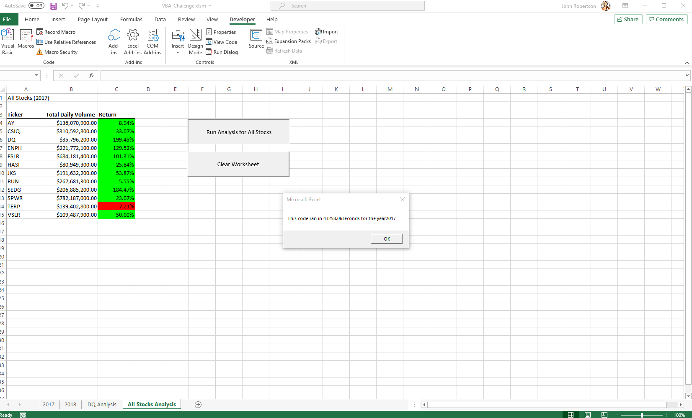

# **_Refactoring VBA Code for Performance Enhancement_**

## **Overview of the Project**

### The purpose of this analysis was to ascertain whether or not reworking a code set in Visual Basic to a cleaner, leaner code, would improve the efficiency and legibility while not sacrificing the outcomes.

## **Results**

### Original 2017

### Refactored 2017

### Original 2018

### Refactored 2018 

### As you can clearly see from the images above, stock performances were substantially better in 2017 compared to 2018. In the process of refactoring the code we did not change the outcomes of the stock’s performance; however, we did significantly reduce the time it took to return the values in both the 2017 and 2018 runs.

## **Summary**

### In refactoring the Stocks Analysis workbook, I have come to the following conclusions:
1)	The advantages of refactoring code are to make it not only more efficient and use less memory, but to also make it easier to interpret should you need to access it again at a later time. The disadvantages could include inadvertently leaving out, for the sake of efficiency, what seems like innocuous pieces of code that turn out to be critical to the original intent.
2)	In this case, refactoring the original VBA script made our runtime markedly better. It also seems that the code is easier to follow when reading it. Thanks in part to excellent indexing, we did not experience any disadvantages’ effects.
